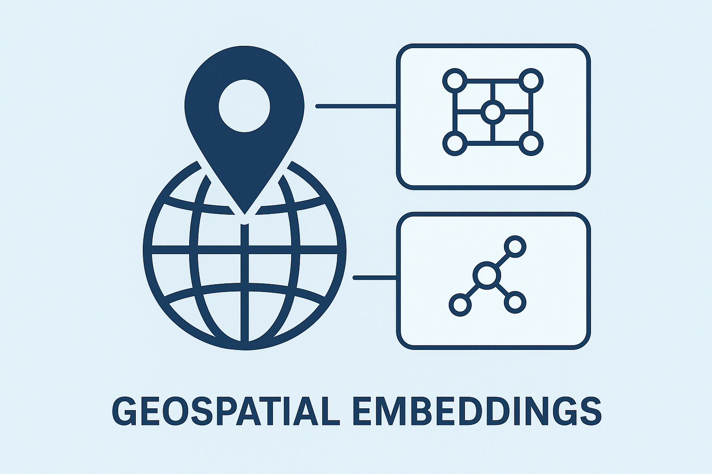

# Geospatial Embeddings Wrapper

<p align="center">
  
</p>
A unified, extensible framework for generating geospatial embeddings from latitude/longitude coordinates using multiple state-of-the-art models.

## Overview

This project provides a clean, modular interface for generating location embeddings from geographic coordinates using:

- **GeoCLIP**: Ground-level image geolocation using CLIP-inspired alignment ([VicenteVivan/geo-clip](https://github.com/VicenteVivan/geo-clip))
- **SatCLIP**: Satellite imagery-based location encoding with spherical harmonics ([microsoft/satclip](https://github.com/microsoft/satclip))

The architecture is designed to be easily extensible to additional geospatial embedding models.

## Key Features

- **Unified Interface**: Single API to generate embeddings from multiple models
- **Coordinate System Handling**: Automatically handles different coordinate conventions (lat/lon vs lon/lat)
- **Extensible Architecture**: Easy to add new embedding models
- **Flexible I/O**: Support for command-line arguments, files (CSV, JSON), and programmatic usage
- **Batch Processing**: Efficient processing of multiple coordinates
- **Dataset Generation**: Create training datasets with land-only sampling
- **Device Flexibility**: Automatic GPU detection with CPU fallback

## Architecture

The project follows an extensible object-oriented design:

```
GeoEmbeddingEncoder (Abstract Base Class)
    ├── GeoCLIPEncoder
    │   └── Uses Equal Earth projection + Gaussian Random Fourier Features
    │   └── Trained on ground-level photos (MP-16: 4.7M images)
    │   └── Input format: (latitude, longitude)
    │   └── Output: 512-dimensional embeddings
    │
    └── SatCLIPEncoder
        └── Uses Spherical Harmonics + SIREN positional encoding
        └── Trained on satellite imagery (S2-100K: 100K images)
        └── Input format: (latitude, longitude) → auto-converted to (longitude, latitude)
        └── Output: 256-dimensional embeddings
```

Adding a new encoder requires:
1. Creating a new class that inherits from `GeoEmbeddingEncoder`
2. Implementing the `encode()` and `get_embedding_dim()` methods
3. Registering it in the scripts

## Installation

### Prerequisites

- Python 3.8+
- pip
- CUDA-capable GPU (optional, but recommended)

### Quick Install

```bash
# Clone the repository
git clone https://github.com/crp94/geospatial_embeddings_wrapper.git
cd geospatial_embeddings_wrapper

# Set up virtual environment (recommended)
python -m venv .venv

# Activate virtual environment
# Windows:
.venv\Scripts\activate
# Linux/Mac:
source .venv/bin/activate

# Clone SatCLIP dependency
git clone https://github.com/microsoft/satclip.git

# Install all dependencies
pip install -r requirements.txt
```

### Verification

Test your installation:

```bash
python scripts/get_embeddings.py --lat 40.7128 --lon -74.0060 --print
```

You should see output indicating both encoders are initialized successfully:

```
Processing 1 coordinate(s)...

Initializing GEOCLIP encoder...
[OK] GEOCLIP encoder ready

Initializing SATCLIP encoder...
[OK] SATCLIP encoder ready

Active encoders: geoclip, satclip
Device: cpu

============================================================
EMBEDDINGS
============================================================

Location 1: (40.7128, -74.0060)
  GEOCLIP: shape=torch.Size([512]), norm=0.2243
  SATCLIP: shape=torch.Size([256]), norm=41.3410

[OK] Done!
```

## Usage

### Command Line Interface

#### Basic Usage - Single Location

Generate embeddings for New York City:

```bash
python scripts/get_embeddings.py --lat 40.7128 --lon -74.0060
```

#### Multiple Locations

Generate embeddings for NYC and Los Angeles:

```bash
python scripts/get_embeddings.py --lat 40.7128 34.0522 --lon -74.0060 -118.2437
```

#### Save to File

Save embeddings to a file:

```bash
python scripts/get_embeddings.py --lat 40.7128 --lon -74.0060 --output embeddings.npz
```

Supported output formats:
- `.npz` - NumPy compressed archive (default)
- `.pt` - PyTorch tensor file

#### Use Specific Encoders

Use only GeoCLIP:

```bash
python scripts/get_embeddings.py --lat 40.7128 --lon -74.0060 --encoders geoclip
```

Use only SatCLIP:

```bash
python scripts/get_embeddings.py --lat 40.7128 --lon -74.0060 --encoders satclip
```

Use a list of encoders explicitly:

```bash
python scripts/get_embeddings.py --lat 40.7128 --lon -74.0060 --encoders geoclip satclip
```

#### Print Embeddings to Console

```bash
python scripts/get_embeddings.py --lat 40.7128 --lon -74.0060 --print
```

#### Device Selection

Force CPU usage:

```bash
python scripts/get_embeddings.py --lat 40.7128 --lon -74.0060 --device cpu
```

Use GPU if available:

```bash
python scripts/get_embeddings.py --lat 40.7128 --lon -74.0060 --device cuda
```

### Input from Files

#### CSV/Text File Format

Create a file `coordinates.txt`:

```
# Format: latitude longitude
40.7128 -74.0060
34.0522 -118.2437
51.5074 -0.1278
```

Or `coordinates.csv`:

```csv
40.7128,-74.0060
34.0522,-118.2437
51.5074,-0.1278
```

Generate embeddings:

```bash
python scripts/get_embeddings.py --input coordinates.txt --output embeddings.npz
```

#### JSON File Format

Create a file `coordinates.json`:

```json
[
  {"lat": 40.7128, "lon": -74.0060},
  {"lat": 34.0522, "lon": -118.2437},
  {"lat": 51.5074, "lon": -0.1278}
]
```

Generate embeddings:

```bash
python scripts/get_embeddings.py --input coordinates.json --output embeddings.npz
```

### Dataset Generation

Generate training datasets with uniformly sampled land coordinates:

```bash
# Generate 100k land points with both encoders
python scripts/generate_dataset.py --n_points 100000

# Use only GeoCLIP
python scripts/generate_dataset.py --n_points 50000 --encoders geoclip

# Custom output path
python scripts/generate_dataset.py --n_points 10000 --output_path my_dataset

# CSV format without plots
python scripts/generate_dataset.py --n_points 5000 --output_format csv --no_plot
```

Dataset output includes:
- Uniformly sampled land-only coordinates (Fibonacci sphere sampling)
- Embeddings from selected encoders
- Visualization plots (location map, density heatmap, PCA projections)

### Programmatic Usage

#### Basic Example

```python
from wrappers import GeoCLIPEncoder, SatCLIPEncoder
import torch

# Initialize encoders
geoclip = GeoCLIPEncoder()
satclip = SatCLIPEncoder()

# Define coordinates (latitude, longitude)
coordinates = torch.Tensor([
    [40.7128, -74.0060],   # New York City
    [34.0522, -118.2437],  # Los Angeles
])

# Generate embeddings
geoclip_embeddings = geoclip.encode(coordinates)  # (2, 512)
satclip_embeddings = satclip.encode(coordinates)  # (2, 256)

print(f"GeoCLIP: {geoclip_embeddings.shape}")
print(f"SatCLIP: {satclip_embeddings.shape}")
```

#### Using the Unified Interface

```python
import sys
from pathlib import Path
sys.path.insert(0, str(Path(__file__).parent.parent))

from scripts.get_embeddings import EmbeddingGenerator

# Initialize generator with all available encoders
generator = EmbeddingGenerator()

# Define coordinates
coordinates = [
    (40.7128, -74.0060),   # NYC
    (34.0522, -118.2437),  # LA
    (51.5074, -0.1278)     # London
]

# Generate embeddings
embeddings = generator.generate_embeddings(coordinates)

# Access embeddings by encoder name
geoclip_emb = embeddings['geoclip']  # (3, 512)
satclip_emb = embeddings['satclip']  # (3, 256)

print(f"GeoCLIP shape: {geoclip_emb.shape}")
print(f"SatCLIP shape: {satclip_emb.shape}")
```

#### Save and Load Embeddings

```python
from scripts.get_embeddings import EmbeddingGenerator
import numpy as np

generator = EmbeddingGenerator()
coordinates = [(40.7128, -74.0060), (34.0522, -118.2437)]

# Generate embeddings
embeddings = generator.generate_embeddings(coordinates)

# Save to file
generator.save_embeddings(embeddings, 'my_embeddings.npz', coordinates)

# Load embeddings
loaded = np.load('my_embeddings.npz')
geoclip_emb = loaded['geoclip']
satclip_emb = loaded['satclip']
coords = loaded['coordinates']

print(f"Loaded {len(coords)} coordinates")
print(f"GeoCLIP: {geoclip_emb.shape}")
print(f"SatCLIP: {satclip_emb.shape}")
```

#### Single Encoder Usage

```python
from wrappers import GeoCLIPEncoder
import torch

# Initialize only GeoCLIP
encoder = GeoCLIPEncoder(device='cuda')

# Single location
coordinates = torch.Tensor([[40.7128, -74.0060]])
embeddings = encoder.encode(coordinates)

print(f"Encoder: {encoder.name}")
print(f"Embedding dimension: {encoder.get_embedding_dim()}")
print(f"Output shape: {embeddings.shape}")  # (1, 512)
```

## Model Details

### GeoCLIP

- **Paper**: [GeoCLIP: Clip-Inspired Alignment between Locations and Images](https://arxiv.org/abs/2309.16020) (NeurIPS 2023)
- **Input Format**: (latitude, longitude)
- **Coordinate System**: Equal Earth projection
- **Encoding Method**: Gaussian Random Fourier Features with multi-scale capsules
- **Embedding Dimension**: 512
- **Training Data**: MP-16 dataset (4.7M geotagged images from Flickr)
- **Use Cases**: Image geolocation, finding photo locations, geographic context from visual semantics

### SatCLIP

- **Paper**: [SatCLIP](https://doi.org/10.1609/aaai.v39i4.32457) (AAAI 2025)
- **Input Format**: (longitude, latitude) - automatically converted from (latitude, longitude)
- **Coordinate System**: Spherical harmonics with Legendre polynomials
- **Encoding Method**: SIREN positional encoding
- **Image Encoder**: Vision Transformer (ViT-16, custom trained)
- **Location Encoder**: Spherical harmonics with configurable L parameter
- **Embedding Dimension**: 256
- **Training Data**: S2-100K dataset (100K Sentinel-2 satellite images)
- **Use Cases**: Climate modeling, land use classification, environmental analysis

### Coordinate System Handling

**Important**: This framework uses a standardized (latitude, longitude) input format for all encoders. The system automatically handles conversions:

- **GeoCLIP**: Expects (lat, lon) ✓ No conversion needed
- **SatCLIP**: Expects (lon, lat) → Automatically converts from (lat, lon)

When adding new encoders, implement coordinate conversion in the encoder's `encode()` method.

## Extending the Framework

### Adding a New Encoder

1. **Create a new encoder file** (e.g., `wrappers/my_encoder.py`):

```python
from .embedding_encoder import GeoEmbeddingEncoder
import torch

class MyEncoder(GeoEmbeddingEncoder):
    def __init__(self, device=None):
        super().__init__(device)
        # Initialize your model here
        self.model = load_my_model()
        self.model.to(self.device)
        self.model.eval()

    def encode(self, coordinates: torch.Tensor) -> torch.Tensor:
        """
        Args:
            coordinates: (N, 2) tensor of [latitude, longitude]
        Returns:
            (N, embedding_dim) tensor
        """
        # Convert coordinates if needed
        # For example, if your model expects (lon, lat):
        # coords_converted = coordinates[:, [1, 0]]

        with torch.no_grad():
            embeddings = self.model(coordinates.to(self.device))

        return embeddings.cpu()

    def get_embedding_dim(self) -> int:
        return 512  # Your embedding dimension

    @property
    def name(self) -> str:
        return "MyEncoder"
```

2. **Register in `wrappers/__init__.py`**:

```python
from .embedding_encoder import GeoEmbeddingEncoder
from .geoclip_encoder import GeoCLIPEncoder
from .satclip_encoder import SatCLIPEncoder
from .my_encoder import MyEncoder  # Add your encoder

__all__ = [
    'GeoEmbeddingEncoder',
    'GeoCLIPEncoder',
    'SatCLIPEncoder',
    'MyEncoder',  # Add here
]
```

3. **Register in scripts**:

```python
# In get_embeddings.py and generate_dataset.py
from wrappers import GeoCLIPEncoder, SatCLIPEncoder, MyEncoder

available_encoders = {
    'geoclip': GeoCLIPEncoder,
    'satclip': SatCLIPEncoder,
    'myencoder': MyEncoder,  # Add your encoder
}
```

4. **Use it**:

```bash
python scripts/get_embeddings.py --lat 40.7128 --lon -74.0060 --encoders myencoder
```

## File Structure

```
geospatial_embeddings_wrapper/
├── wrappers/                 # Encoder wrapper implementations
│   ├── __init__.py           # Package initialization
│   ├── embedding_encoder.py  # Abstract base class for encoders
│   ├── geoclip_encoder.py    # GeoCLIP encoder implementation
│   └── satclip_encoder.py    # SatCLIP encoder implementation
├── scripts/                  # Executable scripts
│   ├── get_embeddings.py     # CLI tool for embedding generation
│   └── generate_dataset.py   # Dataset generator with land sampling
├── examples/                 # Example scripts and notebooks
│   ├── example_usage.py      # Programmatic usage examples
│   └── satclip_dataset.py    # Original reference implementation
├── satclip/                  # SatCLIP repository (git clone)
├── README.md                 # This file
├── QUICKSTART.md             # Quick start guide
├── PROJECT_SUMMARY.md        # Technical overview
└── requirements.txt          # Python dependencies
```

## Troubleshooting

### ImportError: No module named 'geoclip'

**Solution**: Install from requirements.txt:

```bash
pip install -r requirements.txt
```

### ImportError: No module named 'load' (SatCLIP)

**Solution**: Ensure the `satclip` directory exists in your project root:

```bash
git clone https://github.com/microsoft/satclip.git
```

### CUDA out of memory

**Solution**: Use CPU or process fewer coordinates at once:

```bash
python scripts/get_embeddings.py --lat 40.7128 --lon -74.0060 --device cpu
```

Or reduce batch size in programmatic usage.

### Model download fails (SatCLIP)

**Solution**: SatCLIP downloads model weights on first use. The download is cached in:
```
~/.cache/huggingface/hub/
```

If download fails, check your internet connection and try again.

## Performance Notes

- **GPU Recommended**: Both models benefit significantly from GPU acceleration
- **Batch Processing**: Processing multiple coordinates together is more efficient
- **First Run**: SatCLIP downloads model weights on first use

## Citation

If you use this framework, please cite the original papers:

### GeoCLIP

```bibtex
@inproceedings{vivanco2023geoclip,
  title={GeoCLIP: Clip-Inspired Alignment between Locations and Images for Effective Worldwide Geo-localization},
  author={Vivanco, Vicente and Nayak, Gaurav Kumar and Shah, Mubarak},
  booktitle={Advances in Neural Information Processing Systems},
  year={2023}
}
```

### SatCLIP

```bibtex
@inproceedings{klemmer2025satclip,
  title={SatCLIP: Global, General-Purpose Location Embeddings with Satellite Imagery},
  author={Klemmer, Konstantin and Rolf, Esther and Robinson, Caleb and Mackey, Lester and Rußwurm, Marc},
  booktitle={AAAI Conference on Artificial Intelligence},
  volume={39},
  number={4},
  pages={32457},
  year={2025}
}
```

## License

This framework is provided as-is for research purposes. Please refer to the original repositories for their respective licenses:

- GeoCLIP: [MIT License](https://github.com/VicenteVivan/geo-clip/blob/main/LICENSE)
- SatCLIP: [Microsoft License](https://github.com/microsoft/satclip/blob/main/LICENSE)

## Contributing

Contributions are welcome! To add support for a new geospatial embedding model:

1. Fork the repository
2. Create a new encoder class inheriting from `GeoEmbeddingEncoder`
3. Add tests and documentation
4. Submit a pull request

## Acknowledgments

- [Vicente Vivanco](https://github.com/VicenteVivan) for GeoCLIP
- [Microsoft Research](https://github.com/microsoft) for SatCLIP
- The PyTorch and Hugging Face teams for their excellent frameworks

## Contact

For issues, questions, or contributions, please open an issue on GitHub.

---

**Version**: 1.0.0
**Last Updated**: November 2025
**Status**: Production Ready
