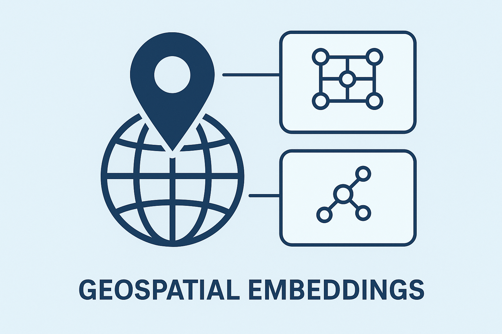

# Geospatial Embeddings Wrapper

<p align="center">
  
</p>

Unified tooling for generating geospatial embeddings from coordinates and for building large land-only embedding datasets with a consistent output format.

## Overview

This repository has two main entry points:

- `scripts/get_embeddings.py`: small point-query CLI for `geoclip` and `satclip`
- `scripts/generate_dataset.py`: land-only dataset generator with support for coordinate models, raster products, and deterministic baselines

The dataset generator currently supports:

- `geoclip`
- `satclip`
- `copernicus_embed`
- `tessera`
- `google_satellite_embedding`
- `range`
- `range_plus`
- `csp`
- `csp_fmow`
- `csp_fmow_unsuper`
- `csp_inat`
- `csp_inat_unsuper`
- `gtloc`
- `torchspatial_direct`
- `torchspatial_cartesian3d`
- `torchspatial_wrap`
- `torchspatial_grid`
- `torchspatial_theory`
- `torchspatial_rff`

All dataset outputs use the same coordinate conventions and save format, even though the underlying models and products use different native coordinate orders and storage layouts.

## What The Generator Does

`scripts/generate_dataset.py`:

- samples candidate coordinates with Fibonacci sphere sampling
- randomizes the Fibonacci phase per run, so repeated runs do not reuse the exact same locations
- filters to land using Natural Earth polygons
- queries one or more encoders
- drops invalid rows for the selected encoder set
- writes `.pt` or `.csv` datasets
- writes location plots and ICA-to-RGB embedding plots

For temporal products, the generator can emit `YYYY.pt` files, one per year.

## Coordinate Conventions

Inside this repo, the standard coordinate input format is always:

- `(latitude, longitude)`

Saved dataset files include both explicit coordinate layouts:

- `coordinates` and `coordinates_latlon`: `(lat, lon)`
- `coordinates_lonlat`: `(lon, lat)`
- separate `latitude` and `longitude` tensors/vectors

For `.pt` outputs, the metadata block records these conventions explicitly.

## Installation

### Prerequisites

- Python 3.10+
- `pip`
- optional CUDA GPU for faster `geoclip` / `satclip`

### Setup

```bash
git clone https://github.com/crp94/geospatial_embeddings_wrapper.git
cd geospatial_embeddings_wrapper

python -m venv .venv
source .venv/bin/activate

pip install -r requirements.txt
```

`satclip/` is vendored in this repository already. You do not need to clone it separately.

## Supported Encoders

### Point-query CLI

`scripts/get_embeddings.py` currently supports:

- `geoclip`
- `satclip`

Example:

```bash
python scripts/get_embeddings.py \
  --lat 40.7128 34.0522 \
  --lon -74.0060 -118.2437 \
  --encoders geoclip satclip \
  --output embeddings.npz
```

### Dataset Generator

`scripts/generate_dataset.py` supports:

- `geoclip`
- `satclip`
- `copernicus_embed`
- `tessera`
- `google_satellite_embedding`
- `range`
- `range_plus`
- `csp`
- `csp_fmow`
- `csp_fmow_unsuper`
- `csp_inat`
- `csp_inat_unsuper`
- `gtloc`
- `torchspatial_direct`
- `torchspatial_cartesian3d`
- `torchspatial_wrap`
- `torchspatial_grid`
- `torchspatial_theory`
- `torchspatial_rff`

Notes:

- `geoclip` and `satclip` are model-backed encoders
- `copernicus_embed` is TorchGeo-backed and auto-downloads its raster
- `tessera` can run through `geotessera` without a local root
- `google_satellite_embedding` can run against the public AEF annual index without a local root
- `range` and `range_plus` wrap the open-weight RANGE models
- `csp` wraps the open-weight Contrastive Spatial Pre-Training location encoder
- `csp_fmow`, `csp_fmow_unsuper`, `csp_inat`, and `csp_inat_unsuper` select the other published CSP variants
- `gtloc` wraps the open-weight GT-Loc GPS branch
- `torchspatial_*` encoders are deterministic coordinate-feature baselines and do not require pretrained weights
- land-only behavior is enforced by this generator layer, not by every source dataset

### Checkpoints For New Models

The new coordinate-only wrappers do not vendor pretrained weights in this repository. Users should download upstream checkpoints and point the generator at them when needed:

- `range` / `range_plus`: pass a local SatCLIP checkpoint and RANGE database with `checkpoint=...;db=...` if the Hugging Face auto-download is not available or if you want a specific local copy
- `csp*`: pass a local CSP `.pth.tar` checkpoint with `checkpoint=...` if the Dropbox auto-download is not available or if you want a specific CSP variant/checkpoint
- `gtloc`: always requires a local GT-Loc checkpoint via `checkpoint=...`
- `torchspatial_*`: no checkpoint is required

Use `--encoder_root` for these paths. It accepts either `encoder=/plain/path` or a semicolon-separated spec such as `encoder=repo=/path/to/repo;checkpoint=/path/to/model.pt`.

## Dataset Generation Examples

Generate a static 100k land-only dataset with the two model-backed encoders:

```bash
python scripts/generate_dataset.py \
  --n_points 100000 \
  --encoders geoclip satclip \
  --device cuda \
  --output_path outputs/example_static
```

Generate a 2024 land-only dataset for the 3 temporal/raster products:

```bash
python scripts/generate_dataset.py \
  --n_points 100000 \
  --encoders copernicus_embed tessera google_satellite_embedding \
  --years 2024 \
  --output_path outputs/example_2024
```

Generate the full 5-product set as separate runs:

```bash
python scripts/generate_dataset.py --n_points 500000 --encoders geoclip --device cuda --output_path outputs/land_only_500k/geoclip_land_500k
python scripts/generate_dataset.py --n_points 500000 --encoders satclip --device cuda --output_path outputs/land_only_500k/satclip_land_500k
python scripts/generate_dataset.py --n_points 500000 --encoders copernicus_embed --output_path outputs/land_only_500k/copernicus_land_500k
python scripts/generate_dataset.py --n_points 500000 --encoders tessera --years 2024 --output_path outputs/land_only_500k/tessera_land_500k
python scripts/generate_dataset.py --n_points 500000 --encoders google_satellite_embedding --years 2024 --output_path outputs/land_only_500k/google_satellite_embedding_land_500k
```

Generate CSV output without plots:

```bash
python scripts/generate_dataset.py \
  --n_points 50000 \
  --encoders geoclip \
  --output_format csv \
  --no_plot \
  --output_path outputs/geoclip_csv
```

Generate the additional coordinate-only encoders:

```bash
python scripts/generate_dataset.py \
  --n_points 500000 \
  --encoders range_plus \
  --encoder_root 'range_plus=checkpoint=/path/to/satclip.ckpt;db=/path/to/range_db_large.npz' \
  --device cuda \
  --output_path outputs/land_only_500k/range_plus_land_500k

python scripts/generate_dataset.py \
  --n_points 500000 \
  --encoders csp \
  --encoder_root 'csp=checkpoint=/path/to/csp_model.pth.tar' \
  --device cuda \
  --output_path outputs/land_only_500k/csp_land_500k

python scripts/generate_dataset.py \
  --n_points 500000 \
  --encoders csp_inat \
  --encoder_root 'csp_inat=checkpoint=/path/to/csp_inat_model.pth.tar' \
  --device cuda \
  --output_path outputs/land_only_500k/csp_inat_land_500k

python scripts/generate_dataset.py \
  --n_points 500000 \
  --encoders gtloc \
  --encoder_root 'gtloc=repo=/path/to/gtloc;checkpoint=/path/to/gtloc.pt' \
  --device cuda \
  --output_path outputs/land_only_500k/gtloc_land_500k

python scripts/generate_dataset.py \
  --n_points 500000 \
  --encoders torchspatial_direct torchspatial_cartesian3d torchspatial_wrap \
             torchspatial_grid torchspatial_theory torchspatial_rff \
  --output_path outputs/land_only_500k/torchspatial_baselines_land_500k
```

## Output Format

### `.pt` output

Each saved dataset contains:

- `metadata`
- `latitude`
- `longitude`
- `coordinates`
- `coordinates_latlon`
- `coordinates_lonlat`
- one `*_embeddings` tensor per encoder

Example keys:

```python
[
    "metadata",
    "latitude",
    "longitude",
    "coordinates",
    "coordinates_latlon",
    "coordinates_lonlat",
    "geoclip_embeddings",
]
```

### `metadata`

The metadata block includes:

- selected encoders
- year
- number of points
- coordinate order declarations
- encoder-specific metadata such as embedding dimension and available years

### Plots

When plotting is enabled, the generator writes:

- `*_locations.png`: sampled land coordinates
- `*_<encoder>_ica.png`: embeddings projected to RGB with ICA

The ICA fit is done on a capped subsample and transformed in batches, so large outputs remain tractable.

## Temporal Products

The following products are temporal in this repo:

- `tessera`
- `google_satellite_embedding`

`copernicus_embed` is treated as a fixed annual product with reference year `2021`.

If you pass `--years`, the generator creates one file per requested year:

```bash
python scripts/generate_dataset.py \
  --n_points 100000 \
  --encoders tessera google_satellite_embedding \
  --years 2023 2024 \
  --output_path outputs/temporal_pair
```

This produces:

- `outputs/temporal_pair_2023.pt`
- `outputs/temporal_pair_2024.pt`

## Architecture

The shared encoder contract is defined in `wrappers/embedding_encoder.py`.

The main implementation split is:

- `wrappers/geoclip_encoder.py`
- `wrappers/satclip_encoder.py`
- `wrappers/torchgeo_encoders.py`
- `wrappers/location_model_encoders.py`
- `wrappers/registry.py`

Canonical encoder names and aliases are centralized in `wrappers/registry.py`.

## Testing

Run the test suite with:

```bash
./.venv/bin/python -m unittest discover -s tests -v
```

Quick syntax check:

```bash
python3 -m py_compile scripts/generate_dataset.py wrappers/torchgeo_encoders.py tests/test_generate_dataset.py
```

## Practical Notes

- Running the 5 encoders separately with the same `--n_points` does not produce the same coordinates, because the Fibonacci sampler is now randomized per run.
- If you need the exact same coordinates across multiple encoder outputs, add a fixed coordinate export/reuse workflow instead of relying on repeated sampling.
- `geoclip` and `satclip` are much faster than the large raster-backed products.
- `tessera` and `google_satellite_embedding` may need substantial network and disk activity on first use.
- `google_satellite_embedding` uses the public AEF annual index and remote GeoTIFF access.

## Licensing Notes

Licensing is not uniform across the supported products.

- `geoclip` package: MIT
- `satclip`: MIT
- `tessera` embeddings in TorchGeo: CC0-1.0
- `copernicus_embed`: CC-BY-4.0
- `google_satellite_embedding`: CC-BY-4.0

For the CC-BY products, attribution is required.

## Repository Layout

```text
geospatial_embeddings_wrapper/
├── images/
├── outputs/
├── satclip/
├── scripts/
│   ├── generate_dataset.py
│   └── get_embeddings.py
├── tests/
├── wrappers/
│   ├── embedding_encoder.py
│   ├── geoclip_encoder.py
│   ├── satclip_encoder.py
│   ├── torchgeo_encoders.py
│   └── registry.py
├── README.md
└── requirements.txt
```
